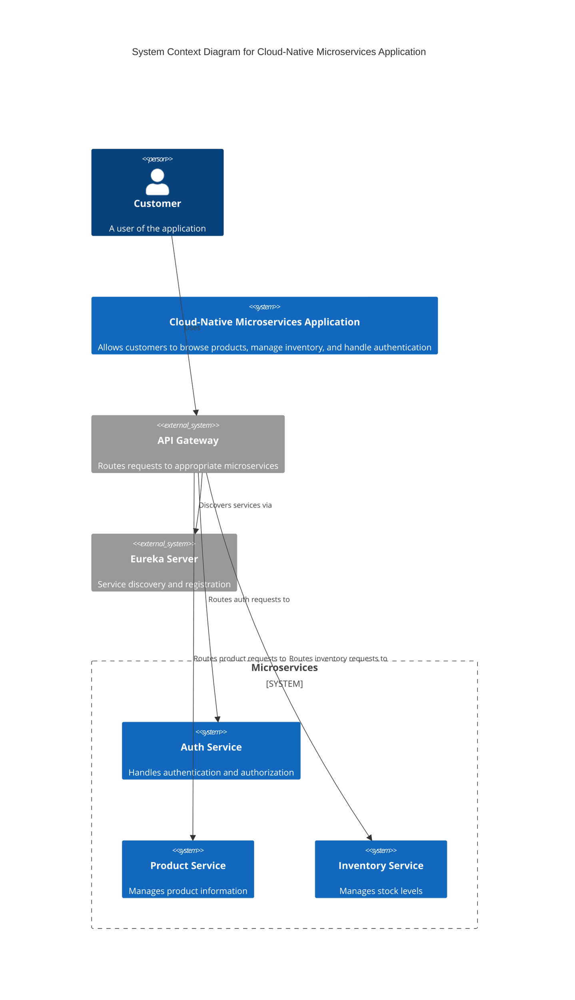
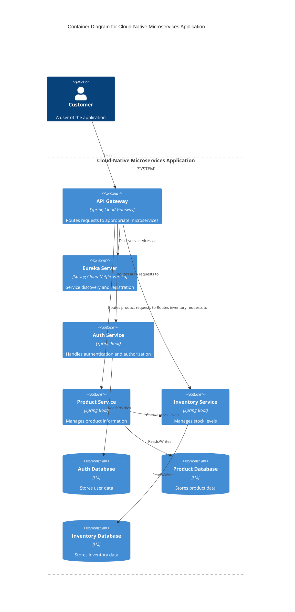
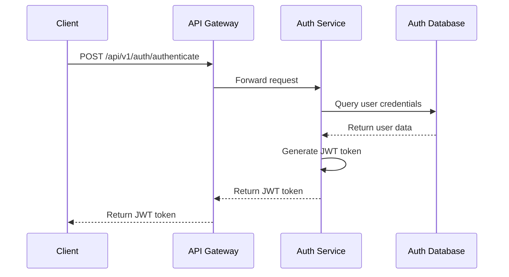
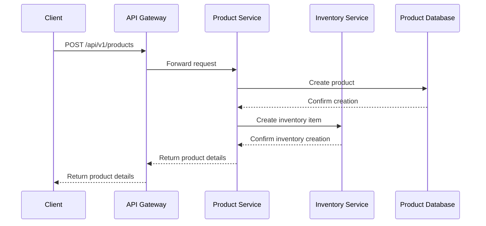
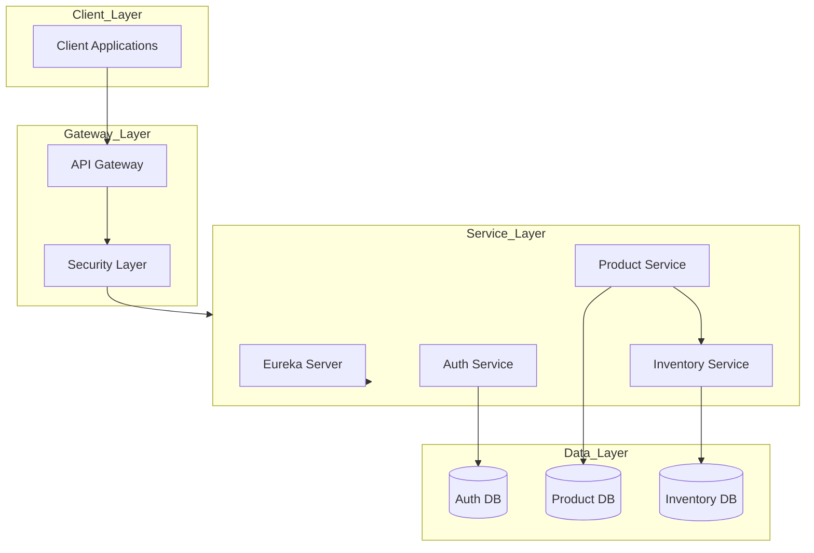
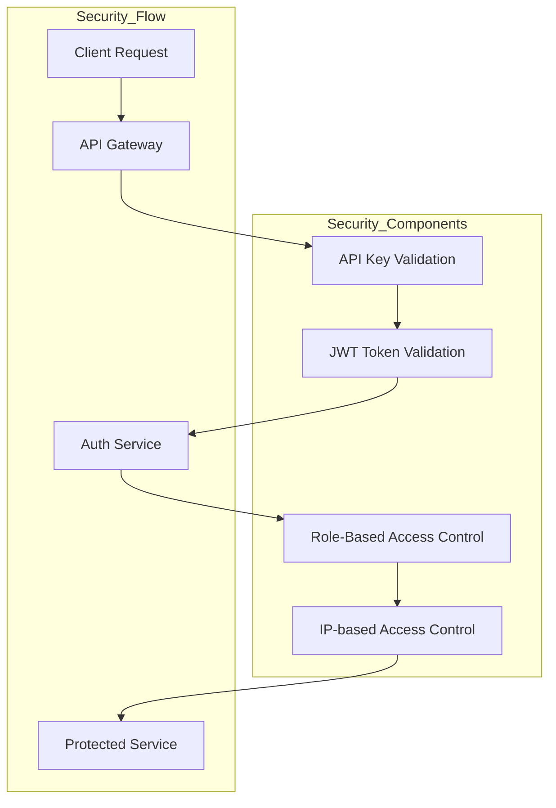

# Cloud-Native Microservices Application

This is a cloud-native microservices application built using Spring Boot, Spring Cloud, and Spring Security. The application follows microservices architecture principles and implements various cloud-native patterns.

## Architecture Overview

The application consists of the following services:

1. **Eureka Server** (Port 8761)

   - Service discovery and registration
   - Health monitoring
   - Load balancing support
   - Swagger UI: http://localhost:8761/swagger-ui.html

2. **API Gateway** (Port 8083)

   - Request routing
   - Request/response transformation
   - Security integration
   - Load balancing
   - Circuit breaking
   - Swagger UI: http://localhost:8083/swagger-ui.html
   - Aggregated API docs for all services

3. **Auth Service** (Port 8081)

   - JWT-based authentication
   - User registration and login
   - Role-based access control
   - H2 database integration
   - Swagger UI: http://localhost:8081/swagger-ui.html
   - OpenAPI JSON: http://localhost:8081/api-docs

4. **Product Service** (Port 8084)

   - Product management
   - CRUD operations
   - Integration with Inventory Service
   - H2 database integration
   - Swagger UI: http://localhost:8084/swagger-ui.html
   - OpenAPI JSON: http://localhost:8084/api-docs

5. **Inventory Service** (Port 8082)
   - Stock management
   - Real-time inventory updates
   - Reservation system
   - H2 database integration
   - Swagger UI: http://localhost:8082/swagger-ui.html
   - OpenAPI JSON: http://localhost:8082/api-docs

## Architecture Diagrams

### C4 Model Diagrams

#### Level 1: System Context Diagram



#### Level 2: Container Diagram



### Sequence Diagrams

#### Authentication Flow



#### Product Creation Flow



### System Design

#### High-Level Architecture



#### Security Architecture



## Prerequisites

- Java 17 or later
- Maven 3.8.x or later
- Git

## Getting Started

1. Clone the repository:

```bash
git clone <repository-url>
cd Cloud-Native-App
```

2. Build all services:

```bash
./mvnw clean install
```

3. Start the services in the following order:

```bash
# Start Eureka Server
cd eureka-server
./mvnw spring-boot:run

# Start Auth Service
cd ../auth-service
./mvnw spring-boot:run

# Start Inventory Service
cd ../inventory-service
./mvnw spring-boot:run

# Start Product Service
cd ../product-service
./mvnw spring-boot:run

# Start API Gateway
cd ../api-gateway
./mvnw spring-boot:run
```

## Service Dependencies

- All services depend on Eureka Server for service discovery
- Product Service depends on Inventory Service for stock management
- API Gateway depends on all services for routing
- Auth Service is used by API Gateway for authentication

## API Documentation

Each service provides Swagger/OpenAPI documentation that can be accessed through their respective Swagger UI endpoints:

### Auth Service

- Swagger UI: http://localhost:8081/swagger-ui.html
- OpenAPI JSON: http://localhost:8081/api-docs
- Endpoints:
  - POST /api/v1/auth/register - Register a new user
  - POST /api/v1/auth/authenticate - Authenticate a user
  - GET /api/v1/auth/validate - Validate a JWT token

### Inventory Service

- Swagger UI: http://localhost:8082/swagger-ui.html
- OpenAPI JSON: http://localhost:8082/api-docs
- Endpoints:
  - GET /api/inventory - Get all inventory items
  - GET /api/inventory/{id} - Get inventory item by ID
  - POST /api/inventory - Create inventory item
  - PUT /api/inventory/{id} - Update inventory item
  - DELETE /api/inventory/{id} - Delete inventory item
  - GET /api/inventory/{id}/stock - Get available stock
  - POST /api/inventory/{id}/reserve - Create reservation
  - POST /api/inventory/reservations/{id}/confirm - Confirm reservation
  - POST /api/inventory/reservations/{id}/cancel - Cancel reservation

### Product Service

- Swagger UI: http://localhost:8084/swagger-ui.html
- OpenAPI JSON: http://localhost:8084/api-docs
- Endpoints:
  - GET /products - Get all products
  - GET /products/{id} - Get product by ID
  - GET /products/category/{category} - Get products by category
  - GET /products/brand/{brand} - Get products by brand
  - POST /products - Create product
  - PUT /products/{id} - Update product
  - DELETE /products/{id} - Delete product

### API Gateway

- Swagger UI: http://localhost:8083/swagger-ui.html
- Aggregated API docs for all services
- Routes:
  - /api/v1/auth/\*\* -> Auth Service
  - /api/v1/products/\*\* -> Product Service
  - /api/v1/inventory/\*\* -> Inventory Service

## Security

### API Gateway Security

- API Key validation for all requests
- JWT token validation for protected endpoints
- IP-based access control

### Auth Service Security

- JWT-based authentication
- Password encryption using BCrypt
- Role-based access control

### Service-to-Service Security

- API Key validation
- JWT token validation
- IP-based access control

## Monitoring

Each service exposes actuator endpoints for monitoring:

- /actuator/health - Health information
- /actuator/metrics - Application metrics
- /actuator/env - Environment properties

## Database

All services use H2 in-memory database for development:

- Auth Service: jdbc:h2:mem:authdb
- Inventory Service: jdbc:h2:mem:inventorydb
- Product Service: jdbc:h2:mem:productdb

H2 Console is available at:

- Auth Service: http://localhost:8081/h2-console
- Inventory Service: http://localhost:8082/h2-console
- Product Service: http://localhost:8084/h2-console

## Development

### Adding New Features

1. Create a new branch
2. Implement the feature
3. Add tests
4. Create a pull request

### Code Style

- Follow Spring Boot best practices
- Use meaningful variable and method names
- Add comments for complex logic
- Write unit tests for new features

## Troubleshooting

### Common Issues

1. Port Conflicts

   - Check if any service is already running on the required port
   - Use `lsof -i :<port>` to check port usage
   - Kill the process using the port: `kill -9 <PID>`

2. Service Registration Issues

   - Ensure Eureka Server is running
   - Check service configuration
   - Verify network connectivity

3. Database Issues
   - Check H2 console connection
   - Verify database configuration
   - Check for schema errors

## Contributing

1. Fork the repository
2. Create your feature branch
3. Commit your changes
4. Push to the branch
5. Open a Pull Request

## License

This project is licensed under the MIT License - see the LICENSE file for details.
